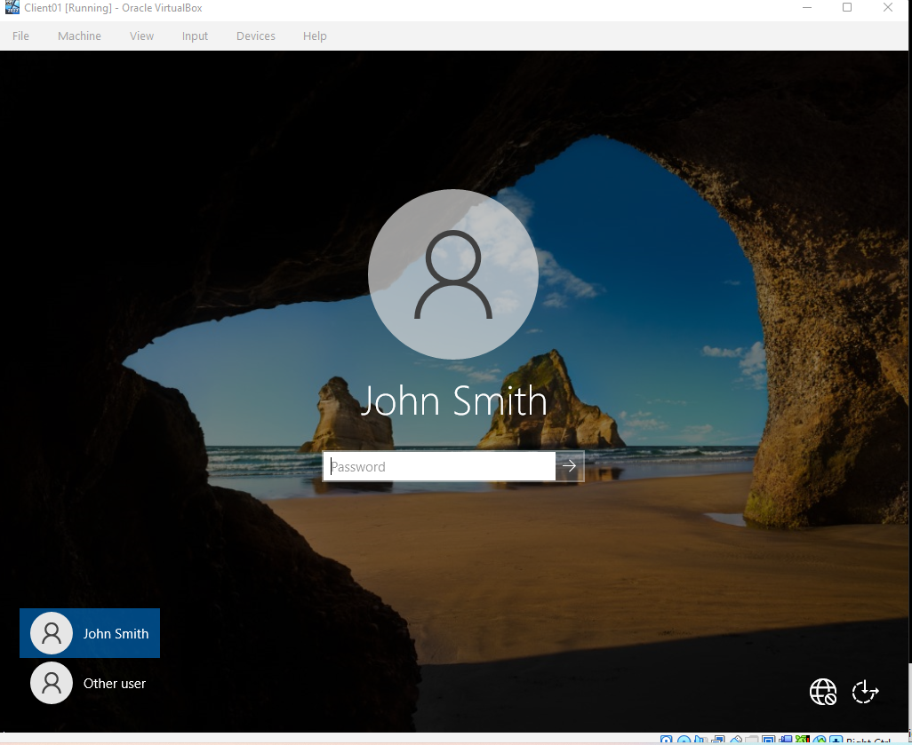
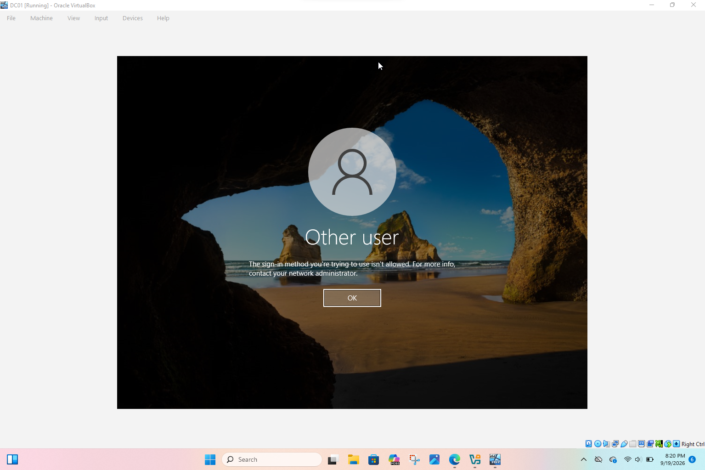

# Active-Directory-Homelab
### Domain Controller Setup
Deployed a fresh Windows Server 2022 VM in VirtualBox and installed the Active 
Directory Domain Services (AD DS) role via Server Manager. Promoted the server 
to a domain controller, creating a new forest and root domain, homelab.local. 
Configured a static IP (10.10.10.1) on the server prior to promotion so the 
domain's DNS would resolve consistently.

### Organizational Units, Users & Groups
Built an OU structure to reflect a small organization, with separate 
Organizational Units for IT, Sales, and HR. Created test user accounts within 
each OU and added them to matching security groups (e.g. IT-Staff) to 
demonstrate group-based access management, a core AD administration task.

### DHCP Configuration
Installed and configured the DHCP server role on the domain controller, 
creating a scope (10.10.10.100–10.10.10.200) to automatically assign IP 
addressing, subnet mask, and DNS server information to domain-joined clients — 
removing the need for manual client-side network configuration.

### Client Domain Join
Deployed a second VM running Windows 10/11 on the same internal network, 
confirmed it received a DHCP-assigned address from the domain controller, and 
joined it to the homelab.local domain. Logged in using a domain user account 
created earlier to confirm authentication against Active Directory was working.

### Group Policy Enforcement
Created a Group Policy Object (GPO) linked to the IT OU that enforces a custom 
interactive logon banner, a common real-world security/compliance requirement. 
Verified the policy applied to the domain-joined client using gpupdate /force 
and confirmed the banner displayed at the Windows login screen.

## Verification
Ran gpupdate /force on the client to confirm the Group Policy applied without 
errors, and verified via System settings that the client showed as joined to 
the homelab.local domain rather than a local workgroup.

## What I Learned
This lab gave me hands-on experience with core Windows Server administration: 
promoting a domain controller, structuring Active Directory with OUs and 
security groups, automating client addressing with DHCP, and enforcing policy 
at scale with Group Policy rather than manual per-device configuration. These 
are foundational skills for supporting Windows-based enterprise networks in a 
NOC or network engineering role, and this lab strengthened my understanding of 
how identity, network services, and policy enforcement work together in a 
domain environment.

## Troubleshooting Notes
Ran into a Windows Server installation failure caused by a storage 
misconfiguration in VirtualBox — the VM's SATA controller had no hard disk 
attached, only the installation ISO, which caused Setup to report "no drives 
found." Diagnosed this by reviewing the VM's Storage settings in VirtualBox, 
corrected the controller type, and attached the previously created virtual 
disk to the SATA controller. This resolved the issue and allowed installation 
to proceed. This reinforced the importance of verifying virtual hardware 
configuration before troubleshooting at the OS/software level.

